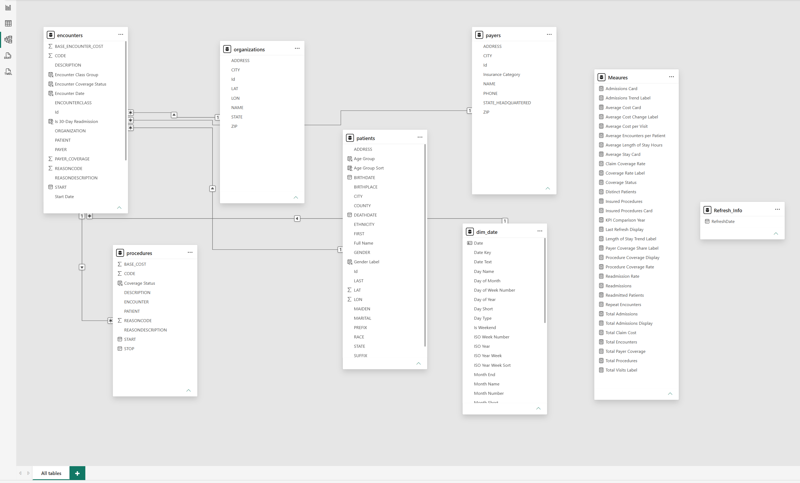
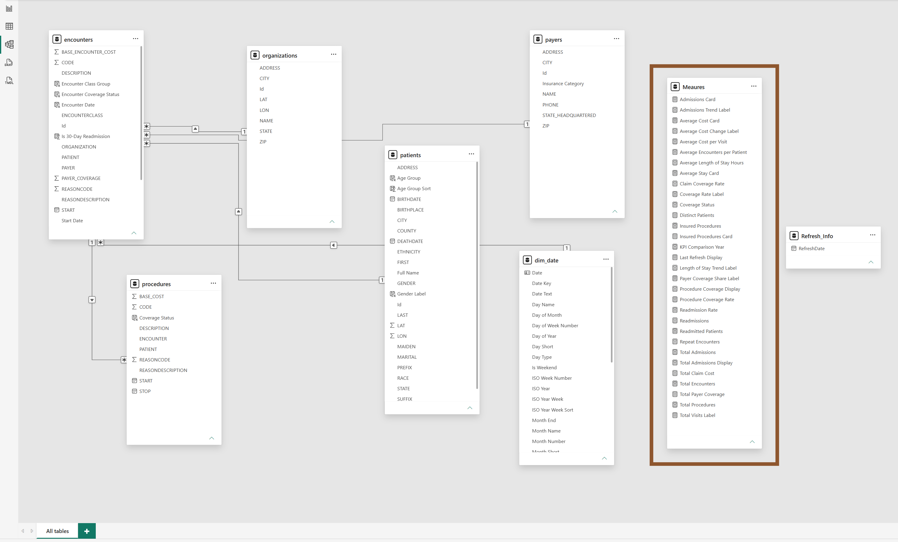

# Hospital Financial Exposure Dashboard

Published Power BI executive dashboard for the Maven Hospital Challenge.

## Overview

For the Maven Hospital Challenge, I acted as an Analytics Consultant for Massachusetts General Hospital (MGH). The objective was to build a high-level KPI report for the executive team using a subset of patient records.

This project translates hospital encounter, patient, payer, procedure, and cost data into an executive dashboard focused on patient volume, readmissions, length of stay, visit cost, and insurance coverage.

The dashboard was built with Power BI, Power Query, DAX, and a structured data model designed for clear KPI reporting.

## Live Dashboard

[View the published Power BI report](https://app.powerbi.com/view?r=eyJrIjoiYTZmOTc5ZDQtMjQ2NS00ZTA4LTk4MTEtY2M3MThlMTI1N2NiIiwidCI6IjY3NzQ1OGU2LThjNTItNDYxMy05ZmRiLTJjYzgzN2Q1ZTRlZiJ9)

## Business Questions

The dashboard answers four executive questions:

1. How many patients have been admitted or readmitted over time?
2. How long are patients staying in the hospital, on average?
3. How much is the average cost per visit?
4. How many procedures are covered by insurance?

## Project Goals

- Build a clean executive KPI report for hospital leadership.
- Model patient, encounter, payer, procedure, organization, and date data.
- Create documented DAX measures for admissions, readmissions, cost, coverage, and utilization.
- Design a dashboard that supports fast stakeholder interpretation.
- Show business insight, not just charts.

## Data Model Architecture

The model connects hospital activity across encounters, patients, procedures, payers, organizations, and date dimensions.

## Centralized DAX Measures Layer

I created a dedicated Measures table to centralize KPI logic for admissions, readmissions, average cost, procedure coverage, payer coverage, and patient utilization metrics.

This improves maintainability because the dashboard visuals use a consistent measure layer instead of scattered calculations.

## Dashboard Build Process

### 1. Data Preparation

Loaded the Maven Hospital Challenge data into Power BI and used Power Query to prepare fields for reporting, including date logic, coverage status, encounter groupings, and patient demographics.

### 2. Data Modeling

Built relationships between key tables:

- encounters
- patients
- procedures
- payers
- organizations
- dim_date
- Measures
- Refresh_Info

### 3. KPI Development

Created measures to support executive reporting, including:

- distinct patients
- total encounters
- total admissions
- readmitted patients
- readmission rate
- average length of stay
- average cost per visit
- total claim cost
- insured procedures
- procedure coverage rate
- payer coverage share

### 4. Dashboard Design

Designed the report to make the most important metrics visible immediately, then supported those metrics with trend, mix, demographic, geography, and narrative visuals.

## Key Dashboard Areas

- Patient and admission overview
- Repeat patients and repeat visit rate
- Patient volume and readmission trend
- Encounter class mix
- Patient demographics
- Patient geography
- Financial exposure and visit cost
- Procedure insurance coverage

## Skills Demonstrated

- Power BI dashboard design
- Power Query data shaping
- DAX measure development
- Data model design
- Healthcare analytics
- Executive KPI reporting
- Data storytelling
- Governance-minded metric definition

## Why This Project Matters

Healthcare executives need reports that turn operational data into decisions. This project shows how raw patient records can be shaped into a dashboard that explains hospital performance, financial exposure, patient flow, and coverage risk.

It also demonstrates how I approach analytics with structure: clean modeling, centralized measures, clear business questions, and executive-ready presentation.

## Portfolio Case Study

[View the portfolio case study](https://beatricekungu.github.io/cyberattack-financial-exposure.html)

## Note

This project was built from challenge/sample data for portfolio demonstration. It does not use confidential patient data.
